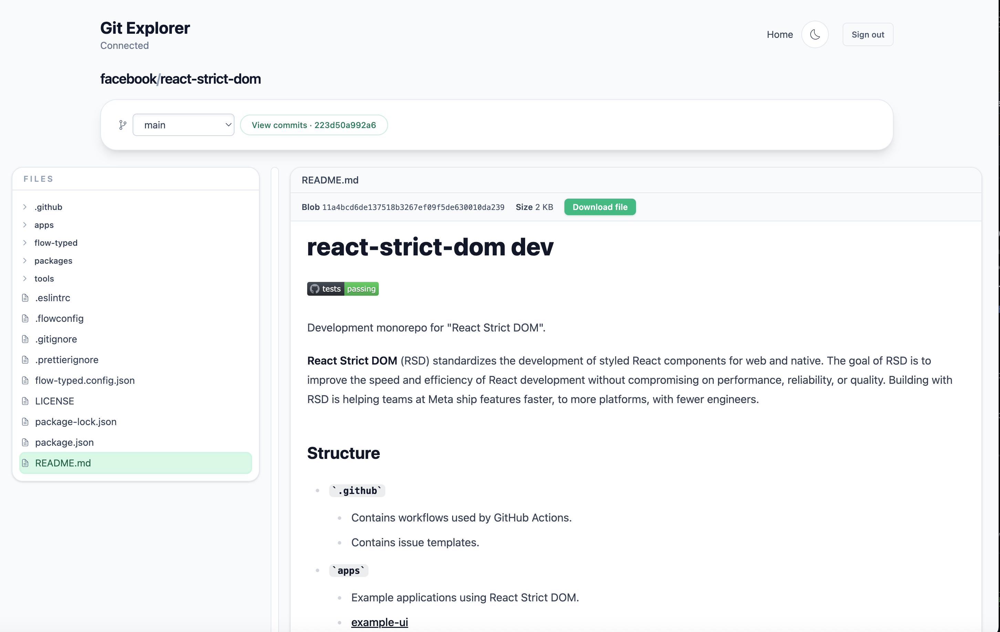
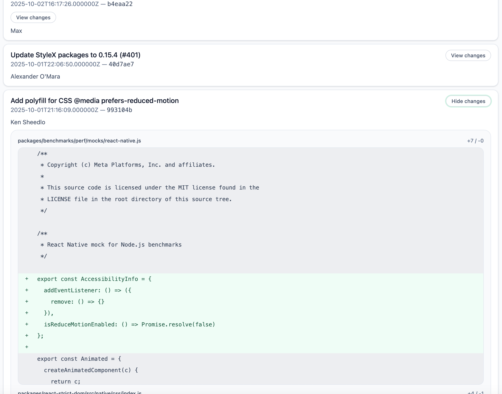

# Powergit

Powergit is a local-first Git explorer that mirrors repositories into PowerSync so you can browse branches, files, and commit history through a fast, reactive UI—no external network calls required once synced.

## Run Locally

```bash
pnpm install
pnpm dev:stack:up
pnpm dev
```

> Requires Docker to be running for the PowerSync + Supabase stack.

## Screenshots


View files and branches.


Uses Tanstack DB integration to handle queries for the commit explorer.

You can view diffs.

## How it works
In this repo we have built a custom git remote protocol that allows us to push git data into a Supabase database. We can later use PowerSync to see the data in the frontend. We use the powersync-tanstack-db package to query the database and show it reactively using the `@tanstack/powersync-db-collection` package.